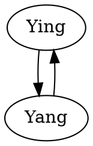

<p align="center">
  
</p>

# Helix
### A Framework for Engineering Consciousness

[](https://github.com/Miserlou/Helix)
[](https://hex.pm/packages/helix)
[](https://github.com/Miserlou/Helix)

**Helix** is a framework for building multi-model, feedback-looping AI systems. It's like a **modular synthesizer** for **AI**. 

Read more about the concept [in this blog post](). In this analogy, if `GPT` is a module making a single tone, `Helix` is a rack full of modules feeding back into each other making a beautiful cacaphony.

You interact with Helix by using and writing **Task Modules**, which provide a single AI capability, and creating **Graphs**, which describe a network of those modules and their inputs and outputs.

### Use Cases

Though the project has lofty goals, Helix as a framework may be practical for all sorts of uses, such as:

 * Building **feedback-driven**, **self-training** and **internally-adversarial** AI systems
 * Making **human-in-the-loop** and **human-out-of-the-loop** AI networks
 * Giving **real-world capabilities** (internet access, UNIX shells, robot controls) to AI systems
 * Designing **multi-modal AI** networks
 * **Unsupervised knowledge creation**

Helix is written in **Elixir** and provides a web interface with **Phoenix LiveView**.

## Installation and Basic Usage

**🚨🚨🚨 Warning! Helix, left unattended, may eat through OpenAI credits as fast as it can! 🚨🚨🚨**

_These instructions assume you have [Elixir installed](https://elixir-lang.org/install.html)._

First, clone this repository and `cd` into it.

Then, install the dependencies:

```
mix deps.get
```

Copy the environment template file:

```
cp .env.tpl .env
```

Next, get your [OpenAI API Keys](https://beta.openai.com/account/api-keys) and put them in `.env`, as well as another configuration settings you want to put.

Run the application with `source .env && mix phx.server`, or use the provided `run.sh` script. The application will now be running at localhost:4000.

### Using the Web Application

_XXX TODO_

## Creating Your Own Graphs

Graphs are described a in DOT format. A very simple GPT feedback graph could be defined like so:



However, DOT is quite limited by itself, so Graph files are actually Liquid templates used to create a DOT file. This makes it much easier to use variable assigns and loops, like so:

```dot



digraph Daoism{
  Ying [module=GPTModule, prompt="{{ying_prompt}}"]
  Ying [module=GPTModule, prompt="{{yang_prompt}}"]

  Ying -> Yang
  Yang -> Ying
}
```

Place your graphs in `./priv/graphs`.

## Creating Your Own Modules

Creating a module is very simple. All a module must do is implement `handle_cast({:convey, event}, state)` to receive inputs from other modules, and at the end of that function call `convey(output_value, state)` to pass a message along.

So, the simplest passthrough module will be:

```elixir
defmodule Helix.Modules.PassthroughModule do

  use Helix.Modules.Module

  def handle_cast({:convey, event}, state) do
    convey(event, state.targets)
    {:noreply, state}
  end

end
```

## Dev TODO

 - ~~Create modified Heex/DOT template format~~
 - ~~Web Interface~~
    - Image representations
    - ~~LiveInput~~
    - ~~Choose Graph from folder, instantiate~~
 - ~~GPTModule templating syntax~~
 - Error Handling / `ErrorModule`
 - Logging, Saving and Restoring
 - Use DynamicSupervisor
 - More modules: `MixModule`, `ClockModule`, `OutputModule`, `TextInputModule`
 - More modules: `ImageInputModule`, `StableDiffusionModule`, `HuggingFaceModule`, `ImageOutputModule`, `WebSearchModule`, `WebExtractTextModule`, `UnixModule`, `GenModuleModule`, `Await`, ~~`GPTDecisionModule`~~ module.
 - Refactor modules names.. don't need Module
 - Create GitHub pages blog

## Ideas to explore

_XXX TODO_

 - Persistent memory
 - Self-embedding
 - Access to the internet
 - Multi-modal stimuli
 - Self-Observing Solving a Puzzle
 - Recursive problem-solving

## Contributing

Please, feel free to play around with Helix! I encourage you to share your feedback, ideas, and experiments. Please use GitHub issues for this.

If you'd like to make code contributions or submit graphs/modules, please send a pull request. However, for me to accept pull requests into the project, you must agree that you assign me the copyright of your contribution. 

(I don't like having to do ask for copyright assignment, but I want to be retain the ability to relicense to something more permissive in the future while still maintaing a defense against parasitic corporations. If you want to discuss this further, feel free to open a meta-issue.)

## License

(c) Rich Jones, 2022+, AGPL.